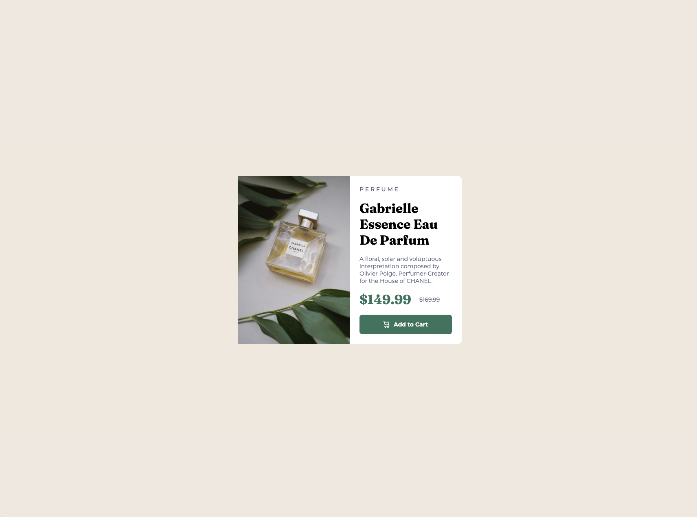
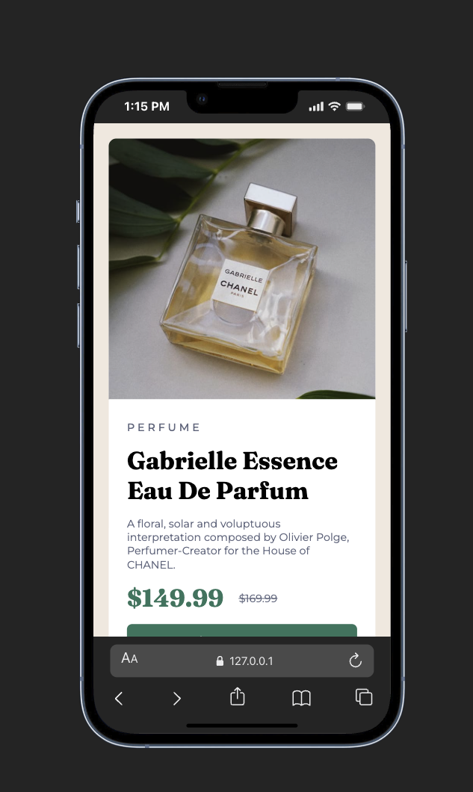

# Frontend Mentor - Product preview card component solution

This is a solution to the [Product preview card component challenge on Frontend Mentor](https://www.frontendmentor.io/challenges/product-preview-card-component-GO7UmttRfa). Frontend Mentor challenges help you improve your coding skills by building realistic projects.

## Screenshot

### Desktop View

### Mobile View

### Links

- Live Site URL: https://mark-ku-dev.github.io/product-preview-card/

## My process

### Built with

- Semantic HTML5 markup
- CSS custom properties
- Flexbox
- Mobile-first workflow
- Plain CSS (no frameworks)

### What I learned

- **BEM structure / naming convention** – Using Block-Element-Modifier naming for CSS classes made the stylesheet easier to read and keep consistent, especially as the card structure grew.

- **Mobile-first layout strategy** – Starting with mobile styles and then adding breakpoints for larger screens helped me focus on the core layout first and avoid overcomplicating the desktop layout.

- **Hiding and showing images by viewport** – I practiced serving different images (e.g. mobile vs desktop product image) using CSS (e.g. `display` or `visibility`) or `<picture>`/`srcset` so the right asset shows at the right screen size.

- **Text decorations** – Working with `text-decoration` (e.g. strikethrough for the original price) and when to use or remove underlines on links and buttons.

### Continued development

- I’d like to keep refining responsive patterns and possibly try CSS Grid for similar card layouts in future projects.
- I want to get more comfortable with accessible focus states and semantic HTML for screen readers.

### Useful resources

- [Add any resources that helped you – e.g. MDN, CSS-Tricks, Frontend Mentor articles]

## Author

- Frontend Mentor - [@yourusername](https://www.frontendmentor.io/profile/yourusername)
- [Add other links – e.g. Twitter, LinkedIn, portfolio]

## Acknowledgments

- [Optional: thank anyone who helped or inspired you, or remove this section.]
